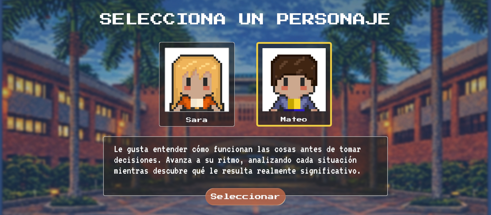
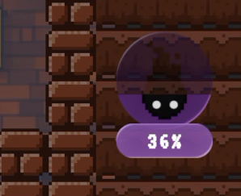
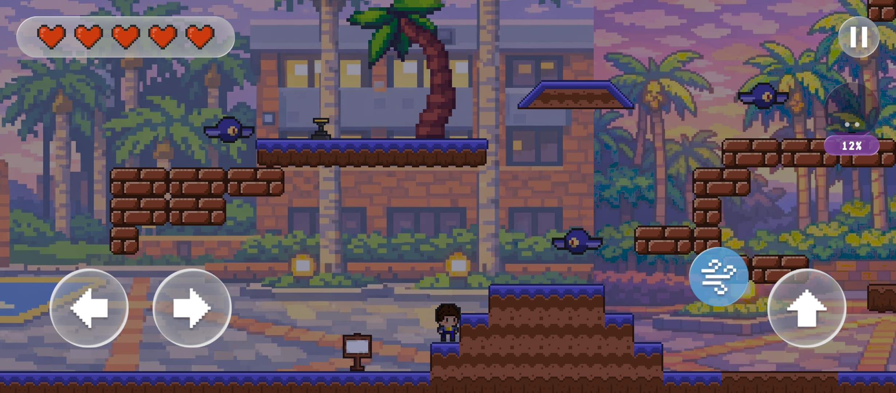
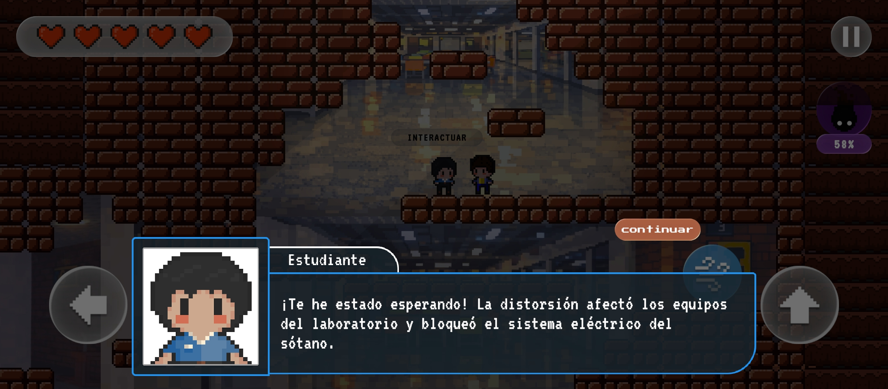
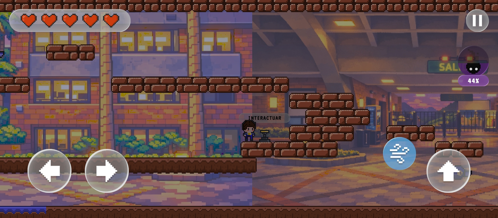
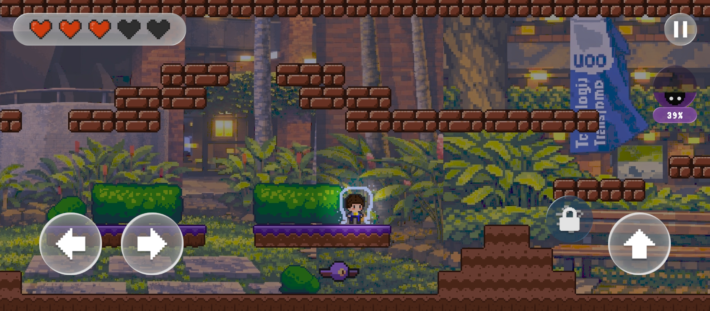
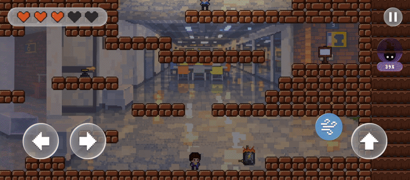

# Expedición UAO

A 2D platformer created as a college project. The game takes place on the college campus and is designed for **Android devices** and available only in Spanish.

## Game Features

1. **Character selection:** Choose whoever you want to play with. Sara or Mateo?

2. **Fear Counter (main feature):** When the fear counter reaches 100%, the player dies. Keep the counter low by using the buttons placed around the world (see feature #5) or the Special Ability (see feature #6).

3. **Enemy AI:** Enemies patrol between two predefined points and hunt the player only when they enter the enemies' detection range.

4. **NPC Interactions:** For giving some context to the player.

5. **World Interactions (Fear counter related):** There are some buttons around the world that the player can use to reduce the fear counter.

6. **Special Ability:** It slows the game speed and reduces the fear counter significantly. This ability has a one time only use. The slow motion does not affect the player's movement (Kind of).

7. **Electric box minigame:** This feature takes place in the campus laboratories. The player must repair three electric boxes by clicking each wire square to connect the circuit correctly. This activates lights in the labs. Repair all three boxes to stop the fear counter.

8. **Discover other characteristics of the game by yourself, such as dynamic jumping height.**

## Download

Download the latest Android APK from the repository's [Releases](../../releases) section.

## Project

This game was developed with Unity 2022.3. The repository contains the project's source code, scenes, assets, and configuration files.

## Technologies

- **Unity 2022.3** for the game engine and project workflow.
- **Unity Input System** for handling player controls and Android input.
- **Animator and custom animations** for player movement, enemies, and other animated elements.
- **Unity 2D tools and Tilemaps** for constructing the game world, organizing levels, and slicing tile-based environments.
- **Unity AI Navigation and [NavMeshPlus](https://github.com/h8man/NavMeshPlus)** for navigation and enemy movement in 2D environments.
- **Universal Render Pipeline (URP)** for 2D rendering and visual effects.